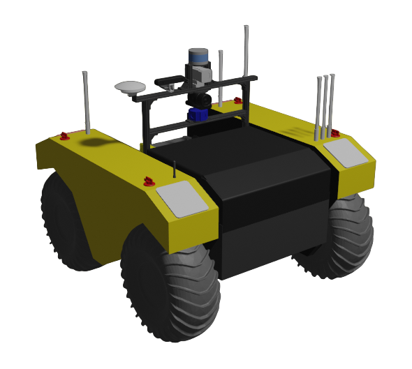
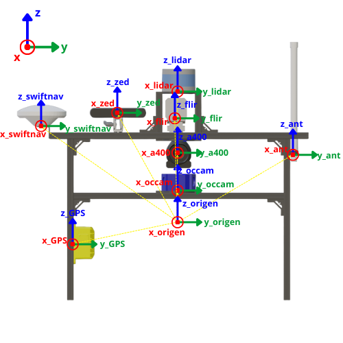
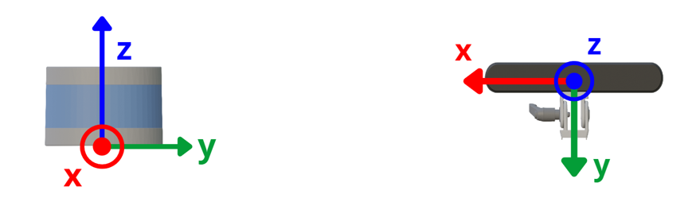
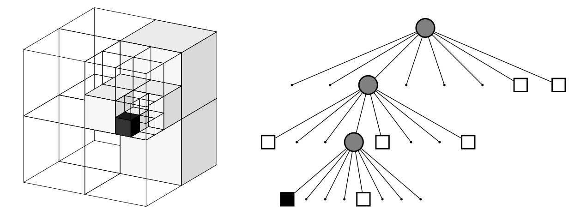
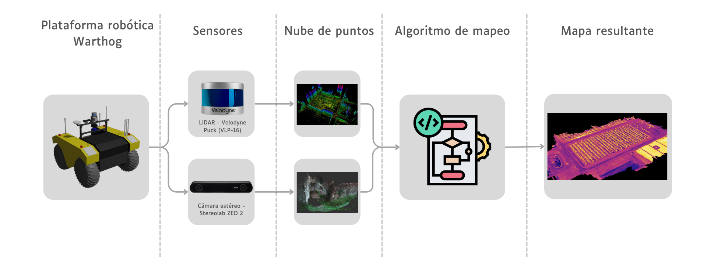
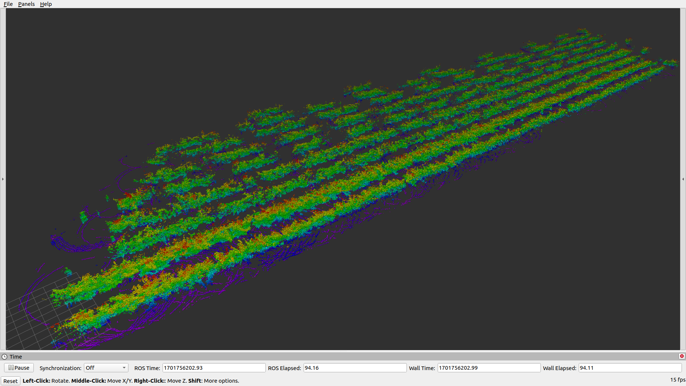

# Implementación y análisis de herramienta de mapeo de entornos frutícolas mediante sensor LiDAR y cámara estéreo montados en plataforma robótica móvil Warthog
Este repositorio alberga una copia de respaldo del trabajo de título elaborado para la obtención del grado de Ingeniero Civil Eléctrico de la Universidad de O'Higgins. Incluye los códigos desarrollados e implementados para este propósito, así como archivos .launch y detalladas instrucciones sobre su utilización. Además, se encuentran disponibles archivos en formato PDF que contienen el trabajo de título, la presentación y manuales importantes.

Cabe destacar que este repositorio contiene el paquete de ROS diseñado tanto para simulación como para trabajar con el robot real. Por lo tanto, si desea alguno en particular, debe tener en cuenta las instrucciones presentes en la instalación de este.

### Instalación
Para utilizar este repositorio, es necesario clonarlo dentro de su directorio de trabajo correspondiente. Para ello, ejecute el siguiente comando en la terminal (reemplace 'ros_workspace' con el nombre de su espacio de trabajo):

```bash
cd ~/ros_workspace/src/
git clone https://github.com/ignaciovsq/warthog_thesis.git
```

- Para clonar este repositorio en el espacio de trabajo de **simulación**:
  ```bash
  cd ~/ros_workspace/src/warthog_thesis/
  mv ~/ros_workspace/src/warthog_thesis/simulation/* ~/ros_workspace/src/warthog_thesis/
  rm -r ~/ros_workspace/src/warthog_thesis/real/ ~/ros_workspace/src/warthog_thesis/simulation/
  ```

- Para clonar este repositorio en el espacio de trabajo con el **robot real**:
  ```bash
  cd ~/ros_workspace/src/warthog_thesis/
  mv ~/ros_workspace/src/warthog_thesis/real/* ~/ros_workspace/src/warthog_thesis/
  rm -r ~/ros_workspace/src/warthog_thesis/real/ ~/ros_workspace/src/warthog_thesis/simulation/
  ```

Finalmente, debe compilar los paquetes de ROS dentro de su espacio de trabajo:
```bash
cd ~/ros_workspace/
catkin_make
source devel/setup.bash
```


## Vehículo terrestre no tripulado Warthog
La plataforma robótica Warthog es una opción excepcional para una variedad de proyectos debido a su versatilidad y capacidad para operar en entornos desafiantes. Diseñada para enfrentar terrenos difíciles, desde suelos blandos y vegetación densa hasta lodo espeso y pendientes pronunciadas, Warthog es un vehículo terrestre no tripulado todo terreno con capacidad incluso para desplazarse brevemente en el agua. Su naturaleza de movimiento, junto con su tracción en las cuatro ruedas y habilidad anfibia, le otorgan una versatilidad sobresaliente en una amplia gama de situaciones. 

Además, su flexibilidad de personalización, con placas de montaje de carga útil y puertos de comunicación y alimentación accesibles, facilita la integración de sensores y equipos adicionales según las necesidades específicas de cada proyecto. Como primer paso, es importante tener en cuenta la ["Guía de Inicio Rápido del Robot Personalizado"](manuals/UDOH03_robotsmith_memo.pdf) disponible en el repositorio.

Clearpath Robotics ofrece tutoriales de sus robots en sus páginas web, donde además de la configuración y operación de la plataforma robótica, proporcionan un tutorial sobre cómo trabajar con el robot de manera simulada en Gazebo. Para acceder a este tutorial, diríjase al siguiente enlace: [Warthog UGV Tutorials](https://www.clearpathrobotics.com/assets/guides/kinetic/warthog/index.html).

<p align="center">
  
</p>


## Base de datos
La base de datos generada durante el desarrollo del trabajo de titulación se construyó a partir de las salidas a terreno con el robot, donde se recopiló información sobre todos los temas publicados por ROS, es decir, información de todos los sensores. Es importante destacar que estos archivos .bag están disponibles en una unidad física (HDD) en el Laboratorio de Robótica y Sistemas Inteligentes (RISLAB) de la Universidad de O'Higgins. La tabla a continuación muestra una descripción general de la base de datos.

<div align="center">

| Lugar | Fecha |  Tamaño total |
| :---: | :---: |  :---: |
| Fundo la Torre, Rengo-Chile | 13-09-2023 | 131.6 GB |
| Fundo la Torre, Rengo-Chile | 24-11-2023 | 212 GB |
| Campo "Agroinvest" (Prize), Rengo-Chile | 24-11-2023 | 18.2 GB |
| Liceo Liceo Agricola El Carmen, San Fernando-Chile | 18-12-2023 | 233 GB |
| Campo Los Gomeros (Prize), Graneros-Chile | 19-12-2023 | 276 GB |

</div>

### Uso de la base de datos
Para utilizar la base de datos, es necesario ejecutar una serie de comandos en la consola.

1. Ejecutar 'roscore'
  
2. Especificar a ROS la utilización del tiempo de los datos.
   ```bash
   rosparam set use_sim_time true
   ```
3. Reproducir los datos desde el archivo .bag. Es importante destacar que se debe especificar qué tópico se desea reproducir. En este caso, se reproducen los datos del sensor LiDAR, el sensor GPS y las transformadas entre sensores (reemplace 'name' con el nombre de su archivo .bag).
   ```bash
   rosbag play --clock --pause name.bag --topics /velodyne_points /piksi/navsatfix_best_fix /tf_static /...
   ```

## Calibración y configuración del equipo
Para lograr una correcta configuración y calibración del equipo en cuestión, se deben seguir una serie de pasos y consideraciones clave. En este contexto, se centrarán en tres aspectos fundamentales: la configuración de la odometría, la configuración manual del URDF (Unified Robot Description Format) y la calibración de la cámara-LiDAR. Estos procesos son esenciales para garantizar el funcionamiento preciso y confiable de un robot en un entorno robótico, y son cruciales para tareas de navegación autónoma, percepción del entorno y toma de decisiones. A continuación, se profundizará en cada uno de estos aspectos para comprender cómo llevar a cabo estas configuraciones de manera efectiva.

### Odometría
La odometría es una técnica esencial en robótica que estima la posición y desplazamiento del robot mediante la recopilación y procesamiento de datos de sensores como encoders y sensores inerciales. Para configurar esta odometría se utiliza el paquete _robot_localization_ de ROS, el cual ofrece algoritmos de fusión sensorial para mejorar la precisión de las estimaciones de posición. Esta configuración se realiza a través de un archivo .YAML (comúnmente llamado localization.yaml), donde se definen los parámetros a tener en cuenta para estimar esta odometría. Para obtener más información sobre la configuración de la odometría, puedes acceder al siguiente enlace: [robot_localization wiki](https://docs.ros.org/en/melodic/api/robot_localization/html/index.html).

```yaml
ekf_localization:
   imu0: um7/imu/data
   imu0_config: [false, false, false,
                 false, false, true,
                 false, false, false,
                 false, false, true,
                 true, false, false]
   imu0_remove_gravitational_acceleration: true

   odom0: warthog_velocity_controller/odom
   odom0_config: [false, false, false,
                  false, false, false,
                  true, true, false,
                  false, false, true,
                  false, false, false]
```

Además, se ha implementado la odometría del robot utilizando datos del GPS con un algoritmo de Python que transforma las coordenadas geográficas (latitud y longitud) a metros. Las ecuaciones 1 y 2 muestran las escalas de conversión utilizadas. 

1. $$1° latitud = 111321 [m]$$
2. $$1° longitud = {40075000 * cos(latitud[°]) \over 360 [m]}$$

Es importante destacar que este algoritmo está diseñado exclusivamente para utilizar la base de datos (no se debe reproducir el topico de odometría obtenido en terreno) y toma como entrada las coordenadas provenientes del tópico *'/piksi/navsatfix_best_fix'*. Para utilizarlo, ejecute el siguiente comando en la ventana de comandos:

```bash
roslaunch package_nacho localization.launch
```

### Configuración "manual"
La configuración "manual" del robot se centra principalmente en la edición del archivo URDF (Unified Robot Description Format), un archivo XML utilizado para describir al robot y proporcionarle conocimiento sobre su estructura y características. Esta información es crucial para que el paquete [tf](http://wiki.ros.org/tf) de ROS pueda llevar un seguimiento preciso de los múltiples marcos de coordenadas a lo largo del tiempo. Esto asegura una correspondencia adecuada de la información proveniente de los sensores, lo cual es fundamental para el funcionamiento correcto del sistema.

La estructura del archivo URDF, que se muestra a continuación, permite la modificación tanto de la traslación como de la rotación de los sensores y/o estructuras con respecto al punto de origen virtual del robot.

``` xml
<?xml version="1.0"?>
<robot xmlns:xacro="http://wiki.ros.org/xacro">

<!-- Sensor Arch Mesh Link -->

  <link name="sensor_arch">
    <visual>
      <geometry>
        <mesh filename="package://udoh03_warthog/meshes/sensor_arch.STL"/>
      </geometry>
      <material name="black" />
    </visual>
    <collision>
      <geometry>
        <mesh filename="package://udoh03_warthog/meshes/sensor_arch.STL"/>
      </geometry>
    </collision>
  </link>

  <joint name="sensor_arch_joint" type="fixed">
    <parent link="bulkhead_link" />
    <child link="sensor_arch" />
    <origin xyz="0 0 0" rpy="0 0 0" />
  </joint>

  ...
```

#### Imagen descriptiva que muestra la posición y orientación de los sensores.

<p align="center">
  
</p>

Cabe destacar que, con el fin de obtener una noción clara de la ubicación de los sensores en relación con el origen virtual, se ha creado una representación digital en Blender. Para acceder a estos archivos, dirigirse al siguiente enlace: [Modelo 3D y archivos Blender](3d_models).


### Calibración de cámara
La calibración de la cámara, ya sea estéreo o monocular, es fundamental en robótica para garantizar la precisión de la información capturada, facilitando así una percepción precisa del entorno. En ROS, el paquete _camera_calibration_ simplifica este proceso, permitiendo una calibración intrínseca más sencilla e interactiva. Los parámetros de calibración son esenciales en este proceso, ya que desempeñan un papel fundamental en la percepción del entorno en el que opera el sistema robótico. Estos parámetros permanecerán constantes en todos los mensajes hasta que se realice una nueva calibración de la cámara. A continuación, se describen los componentes clave de estos parámetros:

- **Coeficientes de distorsión:** Incluye k1, k2, t1, t2 y k3, utilizados para corregir distorsiones en la imagen.
- **Matriz de rectificación:** Se utiliza en cámaras estéreo para alinear el sistema de coordenadas de la cámara con el plano de imagen estéreo ideal.
- **Matriz de cámara intrínseca:** Contiene elementos esenciales como distancias focales y el centro óptico de la cámara en la imagen.
- **Matriz de proyección/cámara:**  Esencial en cámaras estéreo para proyectar puntos 3D en coordenadas de píxeles 2D.

Para llevar a cabo esta calibración, se utilizó un tablero de ajedrez de tamaño A2 con una disposición de 8x6 cuadrículas para la calibración, con cuadrículas de 0.058 metros. Para obtener más información sobre el paquete ROS, diríjase al siguiente enlace: [camera_calibration](http://wiki.ros.org/camera_calibration).

### Calibración de cámara y sensor LiDAR
La calibración cámara-LiDAR consiste en ajustar los parámetros extrínsecos, es decir, la posición y orientación entre ambos sensores. Para llevar a cabo esto se utilizó el trabajo propuesto _extended_lidar_camera_calib_, el cual combina el paquete paquete _livox_camera_calib_ y _FLOAM_ que permite la calibración extrínseca entre la cámara y el sensor LiDAR, utilizando una metodología que extrae bordes tanto de la nube de puntos como de la imagen de la cámara. Para cada voxel obtenido desde la nube de puntos, utiliza RANSAC repetitivamente para extraer planos, mientras que para las imágenes utiliza Canny para extraer los bordes. Luego, este paquete realiza el emparejamiento entre ambos resultados. Y el paquete FLOAM permite obtener una nube de puntos mucho más densa para lograr un mejor rendimiento del algoritmo.

Los pasos para utilizar este paquete son:
1. Ejecutar el algoritmo de obtención de nube de puntos.
2. Configurar el paquete de calibración entre sensores proporcionando la matriz de parámetros extrínsecos entre los sensores. Esta matriz se define a continuación:
   
   <div align="center">
  
    | <!-- --> | <!-- --> | <!-- --> | <!-- --> |
    | --- | --- | --- | --- |
    | $r_{00}$ | $r_{01}$ | $r_{02}$ | $t_x$ |
    | $r_{10}$ | $r_{11}$ | $r_{12}$ | $t_y$ |
    | $r_{20}$ | $r_{21}$ | $r_{22}$ | $t_z$ |
    | 0 | 0 | 0 | 1 |
    
    </div>
    
   Sin embargo, es importante tener en cuenta que los ejes de coordenadas para cada uno de estos sensores no son idénticos. Se puede observar esto en la imagen a continuación.

<p align="center">
  
</p>

   Por lo tanto, si ambos sensores están orientados hacia adelante, para alinear estos ejes de coordenadas, se debe proporcionar la siguiente matriz de parámetros extrínsecos.
   
   <div align="center">
  
   | <!-- --> | <!-- --> | <!-- --> | <!-- --> |
   | --- | --- | --- | --- |
   | 0.0 | -1.0 | 0.0 | $t_x$ |
   | 0.0 | 0.0 | -1.0 | $t_y$ |
   | 1.0 | 0.0 | 0.0 | $t_z$ |
   | 0 | 0 | 0 | 1 |
    
   </div>

3. Ejecutar el algoritmo de calibración entre la cámara y el sensor LiDAR.

Para obtener más información sobre el paquete de calibración, por favor, visite el siguiente enlace: [extender_lidar_camera_calib](https://github.com/sushanthj/extended_lidar_camera_calib). Si desea información más específica sobre los paquetes individuales que componen el anterior, diríjase a los siguientes enlaces: [FLOAM](https://github.com/wh200720041/floam), [livox_camera_calib](https://github.com/hku-mars/livox_camera_calib).  


## Algoritmo de mapeo

### OctoMap
OctoMap es una herramienta de mapeo 3D que utiliza una representación en árbol octal (octree) para dividir el espacio tridimensional en pequeños bloques. Un octree es una estructura de datos jerárquica que divide el espacio en ocho regiones. Cada una de estas regiones puede subdividirse a su vez en ocho regiones más pequeñas, y así sucesivamente. Cada una de estas subdivisiones se conoce como un 'octante'.

Cada octante del octree puede contener información detallada sobre la ocupación del espacio, lo que indica si una región está ocupada por un objeto o si está vacía. Esta información de ocupación se almacena en cada celda del octree y puede ser binaria, representando si la región está ocupada o no, o un valor real que representa la probabilidad de ocupación.

<p align="center">
  
</p>

Para instalar esta herramienta de mapeo en su espacio de trabajo, simplemente ejecute los siguientes comandos en la terminal (reemplace 'ros_workspace' con el nombre de su propio espacio de trabajo):

```bash
cd ~/ros_workspace/src
git clone https://github.com/OctoMap/octomap_mapping.git

cd ~/ros_workspace/
catkin_make
source devel/setup.bash
```

La implementación del algoritmo OctoMap se basa en la recopilación de datos de sensores que permiten al robot mapear su entorno con gran detalle. En este contexto, el robot recopila información de dos sensores clave: un LiDAR VLP-16 y una cámara RGB-D Zed 2. Específicamente, el LIDAR VLP-16 captura una nube de puntos en 3D que representa la geometría del entorno, mientras que la cámara estéreo ZED 2 utiliza su visión estereoscópica para capturar imágenes y procesarlas, generando nubes de puntos tridimensionales que representan con precisión la estructura y los elementos del entorno.

<p align="center">
  
</p>

El algoritmo OctoMap procesa la nube de puntos generada por el LiDAR VLP-16 o la cámara estéreo ZED 2 para construir mapas 3D detallados. Por lo tanto, es necesario configurar qué nube de puntos se utilizará como entrada para la generación de los mapas. Además, el algoritmo utiliza el marco de odometría del robot como referencia, actualizando continuamente la información del mapa según el movimiento detectado. Esto garantiza una representación en tiempo real del entorno en constante cambio. Por lo que, también se debe especificar qué marco de referencia se utilizará.

Una vez que haya configurado este algoritmo, puede proceder a ejecutarlo utilizando el siguiente comando:

```bash
roslaunch package_nacho octomap_mapping.launch
```

Para guardar los mapas generados, ejecute el siguiente comando. Es importante tener en cuenta que el mapa se guardará en la carpeta actual, por lo que asegúrese de estar en el directorio donde desea guardar los mapas (reemplace 'name_map' por el nombre que desee ponerle al mapa).

```bash
cd ~/ros_workspace/src/warthog_thesis/maps/
roslaunch octomap_server octomap_saver f 'name_map'.bt
```

### Visualización de mapas
Una vez que los mapas generados mediante el algoritmo de mapeo han sido almacenados, es posible visualizarlos utilizando el archivo .launch creado. Para ejecutar la visualización de mapas utilice el siguiente comando:

```bash
roslaunch package_nacho octomap_visualizer.launch
```

Al ejecutarlo, se solicitará en la consola que se ingrese el nombre del mapa previamente guardado, especificando su extensión. Una vez ingresado el nombre, este se cargará automáticamente en la ventana de RVIZ, la cual se abrirá con la configuración de visualización ya preestablecida.

<p align="center">
  
</p>


## Extra
En esta sección se presentan aspectos adicionales que pueden ser importantes tener en cuenta al trabajar con la plataforma robótica.

#### Encendido y operación del robot
Una vez encendido el robot, es importante tener en cuenta los siguientes puntos:
- Las luces de la plataforma robótica indican el estado en el que se encuentra el robot. A continuación, se presenta la combinación de luces y su significado:
  - Cuatro luces en rojo: ERROR.
  - Cuatro luces en rojo intermitente: parada de emergencia activada.
  - Luces delanteras en blanco, luces traseras en rojo: operación normal.
- Una vez encendido el robot, se debe desactivar la parada de emergencia para poder operarlo. Para hacerlo, se debe verificar que los cuatro botones de parada de emergencia estén desactivados y conectar el control remoto de parada inalámbrico, manteniendo presionado el botón lateral negro por unos segundos.
- El control remoto se conecta automáticamente con la plataforma. Para operar, considere los siguientes actuadores:
  - Palanca derecha (CH1): control de movimiento hacia adelante/atras del robot.
  - Palanca izquierda (CH2): control de giro del robot hacia la izquierda/derecha.
  - Perilla DL1 (CH4): ajuste de la escala de velocidad.
  - Switch SW2 (CH3): mover hacia arriba para habilitar el transmisor, es decir, para que el control envíe instrucciones al robot.

#### Adquisición de datos
```bash
roslaunch package_nacho rosbag_record.launch
```

#### Monitoreo de batería

```bash
rosrun package_nacho bms_msg.py
```

#### IMU


#### ...


## Trabajo de título y presentación
Para acceder al documento correspondiente al trabajo de título, dirigirse al siguiente enlace: "[Documento de trabajo de título](thesis/TITLE_WORK_IGNACIO_VASQUEZ.pdf)". Si desea visualizar la presentación del trabajo de título, puede utilizar cualquiera de los siguientes enlaces: "[Presentación de trabajo de títutlo](thesis/PRESENTATION_IGNACIO_VASQUEZ.pdf)" o "[Presentación de trabajo de título - Canva](https://www.canva.com/design/DAFgdYkXXaE/4ogQ4hE2SU43HE2vf9G6EA/edit?utm_content=DAFgdYkXXaE&utm_campaign=designshare&utm_medium=link2&utm_source=sharebutton)". Sin embargo, tener en cuenta que solo el enlace de **Canva** permitirá ver los videos incluidos en la presentación.

